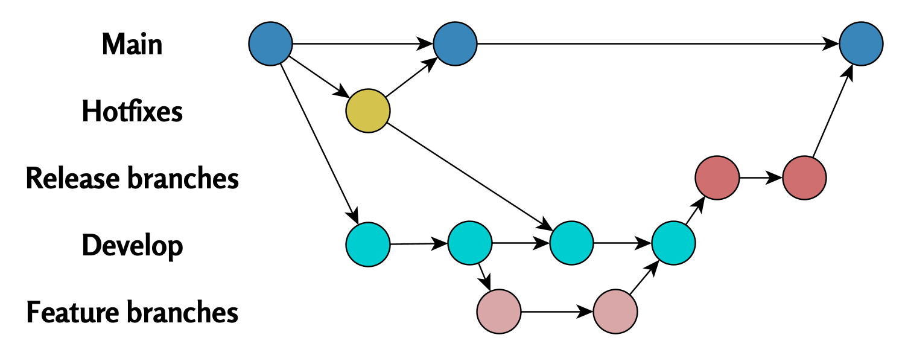

# One Git Branch or Many?{#one-or-many-brances}

  

<figcaption style="font-size: 0.9em; color: gray; margin-top: 5px;">
    Image credit: <a href="https://www.pexels.com/photo/snow-covered-trees-and-road-6551867/" target="_blank">Pexels</a>
</figcaption>
  

Git workflows differ significantly between software development and academic research, which stems from the goals of each project type and team structure. In this chapter, we'll examine these differences and their impact on branch management.

## Git in Software Development

In software development (e.g., computer game programming), teams often utilize multiple Git branches simultaneously.

A typical workflow includes:

- A **main branch** (`main` or `master`), which contains the production version.
- **Multiple other branches**, where individual features are developed and tested separately.

Merges to the main branch are only done when features are complete. This structure enables parallel development, minimizes conflicts, and ensures the main branch remains stable.

The flowchart below illustrates this approach:

 

 

## Git in Academia

In academic research, teams often use just a single **Git main branch**.

Reasons for this:

- Collaboration usually occurs on one or a few shared files (e.g., an article).
- Using branches could be complicated in smaller teams or informal environments.

The following diagram illustrates this workflow structure:

 

  

This approach makes work distribution simple but increases the risk of branch divergence if multiple members modify the same file simultaneously.

## Summary

The differences in Git workflows between software development and academic projects reflect each field's priorities. Software development emphasizes stability and parallel development, while academic projects prioritize simplicity and collaborative work on the main branch.

 

 

------------------------------------------------------------------------

Divergent Git branches - from problem to solution © 2025 by Ville Langén is licensed under the [CC BY-SA 4.0](https://creativecommons.org/licenses/by-sa/4.0/?ref=chooser-v1).

