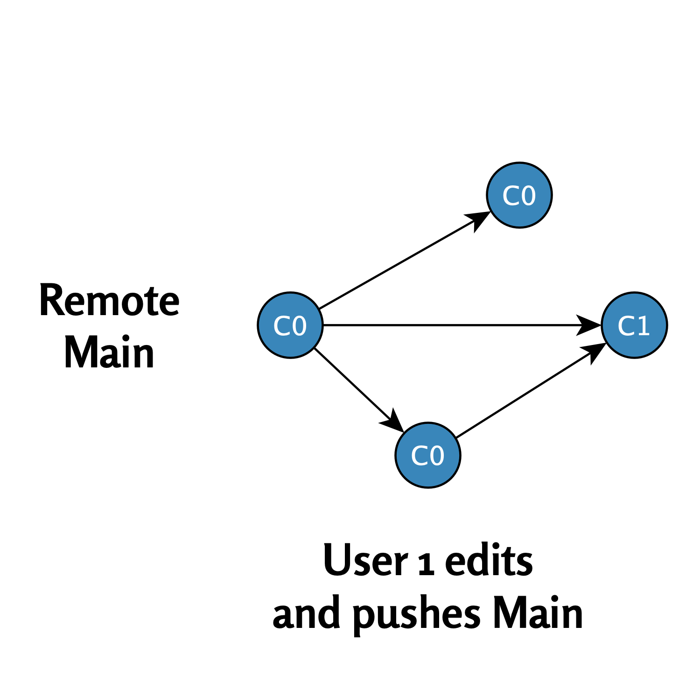

# Branch Divergence{#divergences}

  

<figcaption style="font-size: 0.9em; color: gray; margin-top: 5px;">
    Image credit: <a href="https://www.pexels.com/photo/a-woman-crying-for-help-7640773/" target="_blank">Pexels</a>
</figcaption>
  

In the previous chapter, we examined a situation where two users worked in the main branch without problems. In this chapter, we'll see what happens when two users simultaneously make changes to the same commit state `C0` and try to push their own commits to the remote repository.

\

## Origin of Branch Problems

**Step 1: User 1 and User 2 execute pull command (C0)**

\

Both users start the project from the same initial state. They execute a **pull command** and update their local repositories to commit state `C0`.

The situation is shown in this diagram:

{width="410"}

\

**Step 2: User 1's modifications are accepted to the remote repository**

\

- **User 1** modifies the file and makes commit `C1`.
- **User 1** executes a push command, and commit `C1` is accepted to the remote repository because it's based directly on state `C0`.

{width="415"}

\

**Step 3: User 2's modifications are not accepted to the remote repository**

\

1. **User 2** modifies another part of the file and makes commit `C2`.
2. **User 2** tries to execute a push command, but Git prevents this because the main branch in the remote repository has advanced to commit state `C1`. User 2's local commit `C2` is now in conflict with the remote repository state.

{width="451"}

\

## Summary

\

When two users try to make changes simultaneously and push them to the remote repository, **branch divergence** occurs. This means there is a conflict between the remote repository and local branches that requires additional actions from the user (such as merging or rebasing) to resolve the problem.

\

In the next chapter, we'll discuss how these conflicts can be resolved in different ways.

\

\

------------------------------------------------------------------------

Divergent Git branches - from problem to solution © 2025 by
Ville Langén is licensed under the [CC BY-SA 4.0](https://creativecommons.org/licenses/by-sa/4.0/?ref=chooser-v1).

