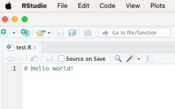

# Fix Method 1: *merge* function{#method-one}

<br><br>

<figcaption style="font-size: 0.9em; color: gray; margin-top: 5px;">
    Image credit: <a href="https://www.pexels.com/photo/abstract-background-of-painting-with-curved-dye-flows-6404219/" target="_blank">Pexels</a>
</figcaption>
<br><br>

In the previous chapter, we examined a situation where two users simultaneously made changes to the same commit state `C0` and tried to push their own commits to the remote repository. In this chapter, we'll see what happens when a user configures Git settings so that the pull command automatically attempts to merge changes.

We'll examine the progression of the situation especially from User 2's perspective.

\

\

------------------------------------------------------------------------

\

## Pull without `merge` permission{#pull-without-merge}

**Step 1: User 1 and User 2 execute pull command (C0)**

\

Both users start the project from the same initial state. They execute a **pull command** and update their local repositories to commit state `C0`.

After this, they begin working on the file `test.R`. At point `C0`, it looks like this for all users:

\

\

(ref:initial-state) Initial state at commit point C0.

```{r initial-state, fig.show='hold', echo=FALSE, out.width='50%', fig.margin = TRUE}



```

**Figure**. Initial state at commit point C0.

\

\

------------------------------------------------------------------------

\

**Step 2: Users 1 and 2 modify the file independently**

\

- User 1 has modified the file and **already pushed it to the remote repository**.
- User 2 has also modified the file but hasn't pushed it to the remote repository yet.

\

(ref:testfile) User 1's changes already in remote repository (left image), User 2's changes not yet pushed (right). The changes clearly differ from each other.

```{r testfile, fig.show='hold', echo=FALSE, out.width=c('44%','10%','44%'), fig.margin = TRUE}

knitr::include_graphics("images/SCR-20250110-uehj.png")
knitr::include_graphics("images/empty_panel_space.png")
knitr::include_graphics("images/SCR-20250110-uejf.png")

```

**Figure**. User 1's changes already in remote repository (left image), User 2's changes not yet pushed (right). ***The users' changes clearly differ from each other.***

\

\

------------------------------------------------------------------------

\

**Step 3: User 2 tries to push their modifications to the remote repository**\

\

- User 2 first tries to execute a pull command, but this fails:

\


**Video**. First - and failed - pull attempt.

\

\

- User 2 tries to execute commit + push command, but this also fails:

\


**Video**. Commit + push also fails.

\

\

- User 2 makes another pull command and receives the following error message with instructions:

\

\

**Video**. New - failed - pull attempt.

\

\

- User 2 copies the following command from Git's instructions to the clipboard:

\

`git config pull.rebase false`

\


**Video**. Command to be copied to clipboard from pull attempt.

\

\

## Giving `merge` permission

Before User 2 makes a third pull attempt, they run the command in Terminal

\

```{bash, eval = FALSE}
git config pull.rebase false
```

\

to give Git permission to attempt merge operation when pulling new changes from the remote repository.

Running the command in Terminal happens as follows:

\

\

```{r rebase_false, echo=FALSE}

knitr::include_graphics("images/Jan-10-2025-23-34-59.mp4")

```

**Video**. Running the command `git config pull.rebase false` in Terminal.

\

\

## Pull with merge permission

Now User 2 can successfully execute a pull command, which creates a new merge commit. However, it produces a warning that instructs to verify that the merge was successful:

\


**Video**. Third pull attempt succeeds.

\

\

Next, User 2 needs to verify by editing the test file `test.r` that the *merge* was successful.

\


**Video**. File `test.R` must be manually edited to fix after the *merge* operation.

\

\

After this, commit + push operations go through without problems:

\

{width="99%"}

**Video**. Commit + push operations go through to the remote repository.

\

\

Now the file `test.R` appears in User 2's updated form in GitHub:

\


**Video**. The merged file now appears in the remote repository on GitHub.

\

\

## Binary files

**Binary files** are files that contain information in a form that cannot be directly read or edited with a text editor. Examples of binary files include Word documents (*.docx*) and bitmap images (e.g., *.png*). These files cannot be merged with Git's *merge* operation because their content cannot be interpreted as simple text, and even small changes in the file can cause large differences in the binary structure.

Even if you set Git to use `git config pull.rebase false` to ensure simpler pulling, it doesn't help resolve merging binary files. When two users make changes to the same binary file in different commit states, a situation arises that requires more robust solutions.

### Example with *.docx*

\

**Step 1: Remote repository state (C0)**

\

All users start from a situation where *test.docx* is in commit state `C0` and looks like this:

\


\

\

**Step 2. User 1 and User 2 make their own modifications to the same Word file:**

\


**Figure**. User 1's modifications.

\


**Figure**. User 2's modifications.

\

\

**Step 3: User 1's changes are accepted**

\

User 1 manages to make commit `C1` and push command after their modifications before User 2, and commit `C1` is accepted to the remote repository because it's based directly on commit state `C0`.

\

\

**Step 4: User 2's changes are rejected**

\

1. User 2 tries to make commit `C2` after modifying the *test.docx* file.\
2. However, Git prevents the push command because the remote repository has moved to commit state `C1`. This causes a conflict.

- User 2 cannot execute commit, push, or pull commands.

\


**Figure**. User 2 gets stuck with Git. Commit state `C1` cannot be pulled, and commit state `C2` cannot be pushed on top of commit state `C1`.

\

Even if **User 2** gives the command `git config pull.rebase false` and tries to pull after that, Git cannot merge the two different versions of the *test.docx* file because it's a binary file.

\

\

## Summary

`git config pull.rebase false` is actually best in situations where users haven't really modified the same file simultaneously but have forgotten to execute a pull command before making modifications to the repository. In such cases, resolving conflicts between commit points is relatively easy for Git.

`git config pull.rebase false` is not, however, a very effective solution for situations where users have truly modified the same file simultaneously. In such cases, the resulting conflicts usually require at least manual merge editing.

For binary files, merging modifications with `git config pull.rebase false` doesn't work at all. Because Git cannot merge the contents of binary files, all such conflict situations must be resolved by other means, such as choosing one version of the file.

We'll discuss the latter in the next chapter.

\

\

------------------------------------------------------------------------

Divergent Git branches - from problem to solution © 2025 by\
Ville Langén is licensed under the [CC BY-SA 4.0](https://creativecommons.org/licenses/by-sa/4.0/?ref=chooser-v1).

[](https://creativecommons.org/licenses/by-sa/4.0/)
