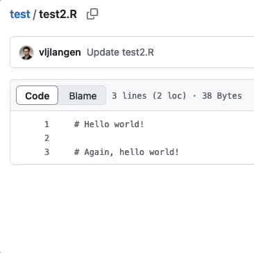
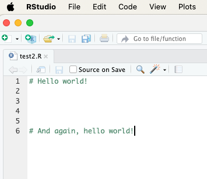
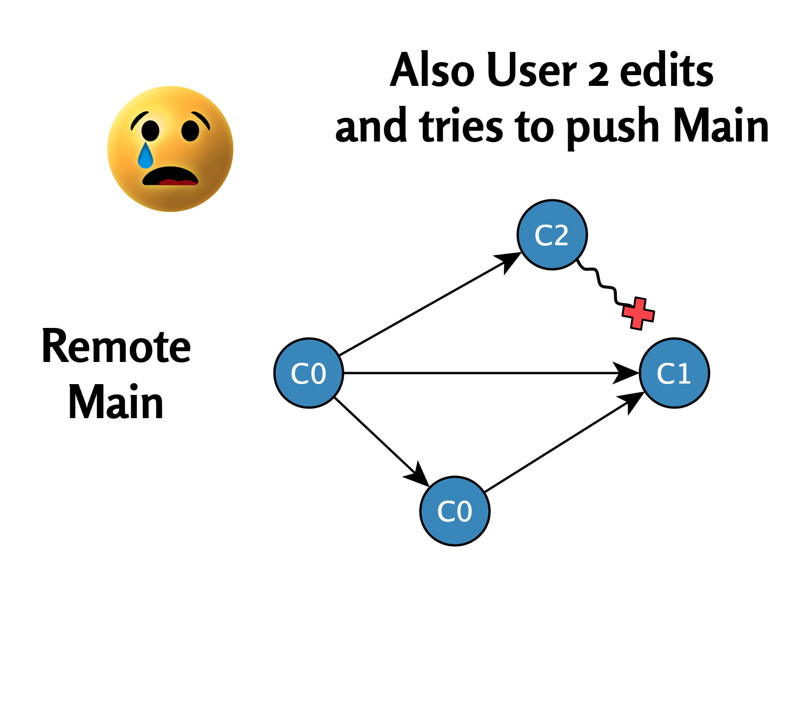

# Fix Method 2: *git reset*{#method-two}

<br><br>

<figcaption style="font-size: 0.9em; color: gray; margin-top: 5px;">
    Image credit: <a href="https://www.pexels.com/photo/road-landscape-art-street-2777776/" target="_blank">Pexels</a>
</figcaption>
<br><br>

When a user tries to make changes but the main branch in the remote repository has advanced simultaneously, Git branch divergence can prevent work from progressing smoothly. One way to resolve such situations is to use the **reset method**. In this chapter, we'll present an example of this.

## Initial Situation{#initial-situation}

The initial situation is similar to what was described in section \@ref(pull-without-merge).

- Users 1 and 2 have this time modified the file `test2.R`.

- User 1 has already performed commit and push operations, so the main branch in the remote repository has already advanced to commit state `C1`. (See image below.)

\

```{r, fig.show='hold', echo=FALSE, out.width=c('44%','10%','44%'), fig.margin = TRUE}

knitr::include_graphics("images/empty_panel_space.png")

```

**Figure**. Versions of file `test2.R` in the remote repository (left) and on User 2's computer (right) differ from each other.

\

- When User 2 now tries to execute a **pull command**, Git prevents this because the local branch is ahead of commit point C0.

\

The situation is shown in the following diagram:

\

{width="451"}

## Reset Command

User 2 can resolve the situation with the following steps:

1. **First backup the problematic file**

    User 2 copies the file `test.R` to their desktop or other backup folder. This prevents the file from being lost when the Git state is updated.

Below is a video of this. Note! If the file being moved to the desktop is open in RStudio, it will warn about the file being moved:

\


**Video**. The problematic file `test2.R` is backed up to the desktop.

\

\

2. **Reset the timepoint to the latest main branch timepoint in the remote repository**

    The user executes the following commands to return to the remote repository's latest state (`C1`):

\

```{bash, eval = FALSE}
git fetch
git reset --hard origin/main
```

\

These commands ensure that:

1. The local repository matches the latest state of the remote repository
  - `git fetch` downloads the latest changes from the remote repository without changing local files
2. `git reset --hard origin/main` returns the local branch and workspace exactly to the remote repository's state.

\


**Video**. Reset command.

\

\

3. **Examining the `test2.R` file**

    By opening the `test2.R` file, User 2 can see that the file has returned to User 1's modified commit state `C1`:

\


**Video**. Examining the `test2.R` file.

\

\

4. **Restoring User 2's modified `test2.R` file**

    User 2's modified `test2.R` file can now be restored from the desktop to the local Git repository. At the same time, it is renamed to `test2 copy.R`:

\


**Video**. Restoring file `test2.R` from desktop.

\

\

5. **Examining files `test2.R` and `test2 copy.R`**

    User 2 can now examine the differences between these files in RStudio:

\


**Video**. Examining files `test2.R` and `test2 copy.R` in RStudio.

\

\

6. **Commit and push operation to remote repository**

\

User 2 can now perform commit and push operations for the file `test2 copy.R`:

\


**Video**. Successful commit and push operation.

\

\

7. **Examining the remote repository in GitHub**

\

User 2 can now verify that their modified file `test2 copy.R` appears in the remote repository:

\


**Video**. The file `test2 copy.R` now appears in the remote repository.

\

## Summary

The reset method offers a straightforward and effective way to resolve situations where the local branch and remote repository have diverged. The most important steps include backing up the problematic file, using the reset command to return to the remote repository state, and finally restoring the file with a new name. This way, users can continue working without losing data, and commit and push operations work again.

The reset method helps avoid resolving more complex conflicts while preserving both your own work and the integrity of the team's main branch.

\

------------------------------------------------------------------------

Divergent Git branches - from problem to solution © 2025 by Ville Langén is licensed under the [CC BY-SA 4.0](https://creativecommons.org/licenses/by-sa/4.0/?ref=chooser-v1).

[](https://creativecommons.org/licenses/by-sa/4.0/)
